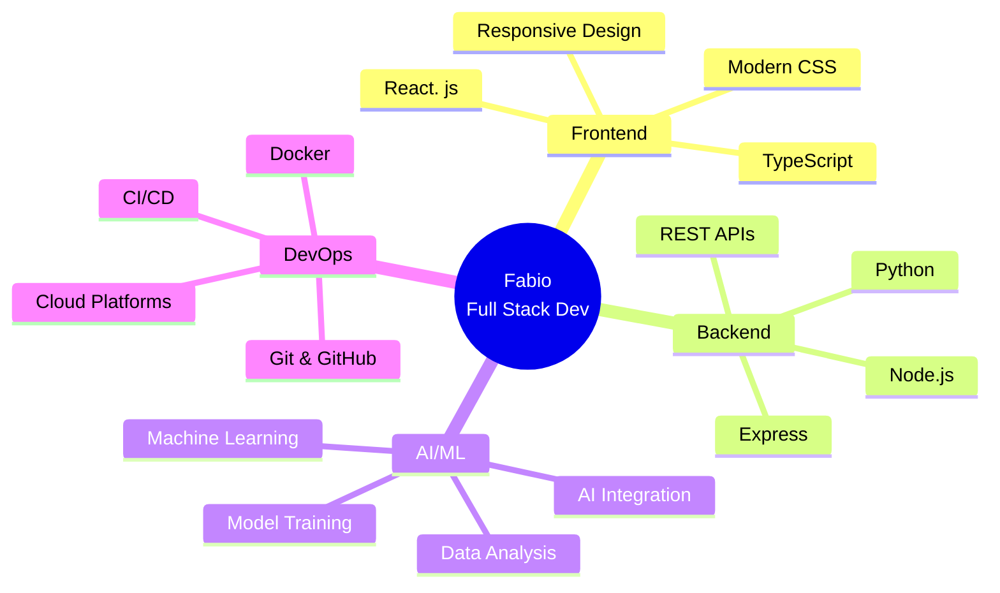

<div align="center">

# 👨‍💻 Fabio - Full Stack Developer & AI Enthusiast


<p align="center">
  
  
</p>

### 🌟 Passionate about transforming ideas into elegant, functional code

</div>

---

## 🚀 About Me

```typescript
const fabio = {
    location: "🌎 Working Remotely",
    languages: ["Spanish 🇪🇸", "English 🇺🇸"],
    currentFocus: ["AI/ML", "Full Stack Development", "Cloud Architecture"],
    lifePhilosophy: "Code is poetry, bugs are just plot twists 🎭",
    askMeAbout: ["Web Dev", "AI", "Tech Trends", "Coffee ☕"],
    funFact: "I debug with console.log() and I'm not ashamed 😎"
};
```

<div align="center">

## 💻 Tech Stack

### Frontend Development


### Backend Development


### AI & Machine Learning


### Databases & Tools


</div>

---

## 📊 GitHub Stats

<div align="center">
  
  
</div>

<div align="center">
  
</div>

<div align="center">
  
</div>

---

## 🏆 GitHub Trophies

<div align="center">
  
</div>

---

## 🔥 Current Projects & Focus

<table align="center">
  <tr>
    <td align="center" width="33%">
      
      <br><strong>🤖 AI Integration</strong>
      <br><sub>Building intelligent solutions with ML</sub>
    </td>
    <td align="center" width="33%">
      
      <br><strong>🌐 Full Stack Apps</strong>
      <br><sub>React + TypeScript + Node.js</sub>
    </td>
    <td align="center" width="33%">
      
      <br><strong>🌟 Open Source</strong>
      <br><sub>Contributing to the community</sub>
    </td>
  </tr>
</table>

---

## 📈 Coding Activity

<div align="center">

<!--START_SECTION: waka-->
<!--END_SECTION:waka-->

</div>

---

## 🎯 Skills Visualization

<div align="center">



</div>

---

## 💡 Fun Facts & Interests

<div align="center">

| 🎯 Current Goals | 🌱 Learning | 💼 Open To |
|: ---:|:---:|:---:|
| Master AI/ML | Cloud Architecture | Collaborations |
| Build 10 Projects | Advanced TypeScript | Freelance Work |
| Contribute to OSS | System Design | Innovative Ideas |

</div>

---

## 📫 Let's Connect!

<div align="center">

[](https://linkedin.com/in/fabiofv)
[](https://twitter.com/fabiofv)
[](https://fabio. dev)
[](mailto:fabio@example.com)

</div>

---

<div align="center">

### 💭 Dev Quote of the Day


### 🐍 Contribution Snake


</div>

---

<div align="center">

### 🎵 Coding Soundtrack


<sub>🎧 Vibing to music while coding</sub>

</div>

---

<div align="center">

**"Code is like humor. When you have to explain it, it's bad."** – Cory House


</div>
